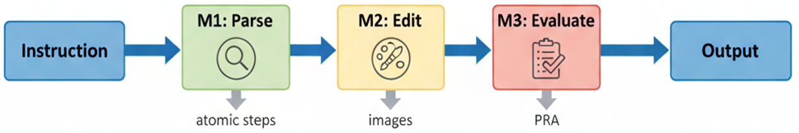

# ATOMIC EDITS: Instruction Decomposition for Diffusion-Based Image Editing

A three-stage pipeline that decomposes complex image editing instructions into atomic, verifiable operations. Achieves 58% per-requirement accuracy with 18% better structural preservation than one-shot methods.

---

## 🎯 Problem

Current diffusion models fail on composite instructions like *"make the shirt blue and remove the logo"*:
- Execute only some requirements while ignoring others
- Later edits override earlier ones
- No clear indicators of which requirements succeeded

---

## 🏗️ Solution: Atomic Decomposition Pipeline

**Three stages:**


**Three stages:**
1. **Parse** → Decompose instructions into atomic JSON operations (Llama-3.1)
2. **Edit** → Execute sequentially with region-aware masking (GroundingDINO + SAM + InstructPix2Pix)
3. **Evaluate** → Verify each requirement independently (BLIP-2 + CLIP)

---

## ✨ Key Features

- **Requirement-level transparency**: Know exactly which edits succeeded/failed
- **Automated region detection**: GroundingDINO + SAM for precise masking
- **Polarity-aware evaluation**: Handles both "add/change" and "remove" instructions
- **Order-insensitive**: SSIM 0.999 when swapping instruction order

---

## 📊 Results

**Performance Summary:**

| Metric | Score | Details |
|--------|-------|---------|
| Overall PRA | 58% | 56/97 requirements passed |
| Color changes | 100% | Perfect with HSV recolor |
| Properties | 50-60% | Brightness, sharpness, etc. |
| Removals | 0-25% | Limited by inpainting quality |
| SSIM improvement | +18% | Over one-shot baseline |

**Complexity Scaling:**

| Requirements | Atomic | One-shot | Improvement |
|--------------|--------|----------|-------------|
| 2 reqs | 71% | 52% | +37% |
| 3 reqs | 54% | 31% | +74% |
| 5 reqs | 33% | 11% | +200% |

---

## 🛠️ Installation

### Prerequisites
- Python 3.10+
- CUDA GPU (recommended) or Apple Silicon (MPS supported)
- 16GB+ RAM

### Setup
```bash
# Clone repository
git clone https://github.com/shreyasakpal/atomic-edits.git
cd atomic-edits

# Create virtual environment
python -m venv .venv
source .venv/bin/activate  # Windows: .venv\Scripts\activate

# Install dependencies
pip install -r requirements.txt

# Download model checkpoints (see CHECKPOINTS.md)
mkdir -p checkpoints
# Follow instructions in CHECKPOINTS.md to download:
# - GroundingDINO weights (~700MB)
# - SAM weights (~375MB)
```

---

## 🚀 Quick Start

### End-to-End Example
```bash
python -m atomic_edits.pipeline.cli_e2e \
  --image images/shirt.png \
  --text "make the shirt blue and remove the logo" \
  --outdir results/demo \
  --backend ollama \
  --ollama-model llama3.1:8b-instruct-q4_K_M
```

**Output:**
```
results/demo/
├── parsed/parse.json           # Decomposed instructions
├── edits/
│   ├── step_01.png             # Intermediate results
│   ├── step_02.png
│   ├── final.png               # Final output
│   └── mask_step_01.png        # Region masks (with --save-mask-debug)
└── m3/
    ├── m3_results.jsonl        # Per-requirement verification
    └── m3_report.md            # Accuracy report
```

### Individual Stages

**1. Parse instruction:**
```bash
python -m atomic_edits.parser.cli \
  --text "make the mug blue and add text 'COFFEE'" \
  --backend ollama \
  --ollama-model llama3.1:8b-instruct-q4_K_M
```

**2. Region-aware editing:**
```bash
python -m atomic_edits.editor.cli_region \
  --image input.jpg \
  --json parsed/001.json \
  --outdir edits/001 \
  --masker gdino_sam
```

**3. Evaluate results:**
```bash
python -m atomic_edits.m3.evaluate \
  --examples-root artifacts/examples \
  --out-root artifacts/m3
```

---

## 📁 Project Structure
```
atomic-edits/
├── atomic_edits/
│   ├── parser/              # Instruction decomposition (Llama-3.1)
│   ├── editor/              # Sequential editing (InstructPix2Pix)
│   ├── region/              # Masking (GroundingDINO + SAM)
│   ├── m3/                  # Evaluation (BLIP-2 + CLIP)
│   │   └── evaluator/
│   └── pipeline/            # End-to-end orchestration
├── images/                  # Sample test images
├── checkpoints/             # Model weights (see CHECKPOINTS.md)
├── requirements.txt
└── README.md
```

---

## 🔬 Technical Details

### Models

| Component | Model | Purpose |
|-----------|-------|---------|
| Parsing | Llama-3.1-8B | Instruction → JSON decomposition |
| Detection | GroundingDINO (SwinT) | Open-vocabulary object detection |
| Segmentation | SAM (ViT-B) | Precise region masking |
| Editing | InstructPix2Pix | Diffusion-based image editing |
| VQA | BLIP-2 (Flan-T5-XL) | Yes/no requirement verification |
| Alignment | OpenCLIP (ViT-B/32) | Visual-semantic similarity |

### Evaluation Metrics

- **PRA (Per-Requirement Accuracy)**: % of atomic edits that passed verification
- **SSIM/LPIPS**: Structural preservation in non-edited regions
- **Decision rule**: BLIP-2 confidence ≥ 0.60 AND CLIP margin ≥ 0.05

---


## ⚙️ Configuration

**Key parameters in `cli_e2e.py`:**
```bash
--steps 9                      # Diffusion inference steps
--guidance-scale 4.8           # Text guidance strength
--image-guidance-scale 2.4     # Image conditioning strength
--masker gdino_sam             # Detection backend
--det-box-thresh 0.35          # GroundingDINO confidence
--save-mask-debug              # Save mask visualizations
```

---


